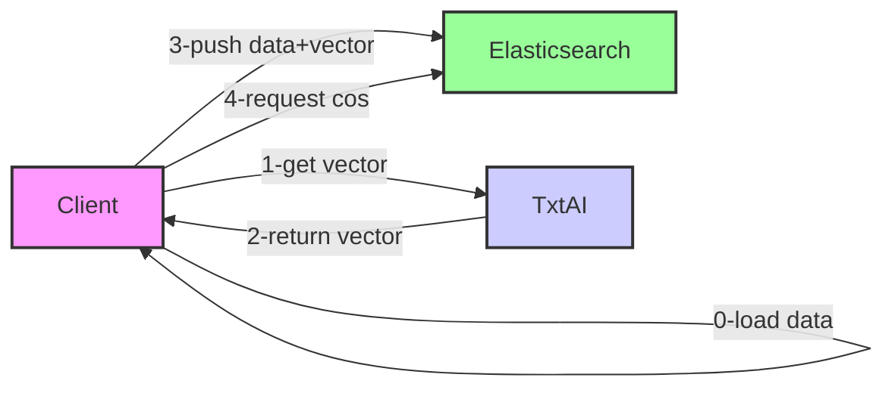

# txtai-elasticsearch

## Schema




## 1- Start stack 
```
./start.sh
```

## 2- Create Elasticsearch Index with Kabana

### Accès Kibana
http://loacalhost:5601

### Create Index
```
PUT /movies
{
  "mappings": {
    "properties": {
      "title": {
        "type": "text"
      },
      "synopsis": {
        "type": "text"
      },
      "genre": {
        "type": "keyword"
      },
      "release_year": {
        "type": "integer"
      },
      "title_embedding": {
        "type": "dense_vector",
        "dims": 384
      }
    }
  }
}
```


## 3- Manage data with **manageDatas** directory 

### Load datas
```
npm install
node load-data.js
```

### Search data

```
node searchByVector.js
```

NB:  You can search all datas with kibana query
```
GET /movies/_search
{
  "query": {
    "match_all": {}
  }  
}
```


## Issue
if elasticsearch has error : 
  ```
    Elasticsearch exited unexpectedly, with exit code 78
  ```
then execute the following command
  ```
    sudo sysctl -w vm.max_map_count=262144
  ```

## Liens
https://medium.com/bigdata-blog/how-to-use-elasticsearch-as-vector-database-5f1768f7d46a


## Vrac

curl -X GET "http://localhost:8000/transform?text=RE%3A+Would+machine+learning+be+suitable+for+finding+the+seed+of+a+random+number+generator%3F+Machine"


curl -X POST "http://localhost:8000/add" -H "Content-Type: application/json" -d '[{"text": "text"}]'

https://blog.gcn.sh/howtos/installing-libretranslate-using-docker-and-ubuntu


