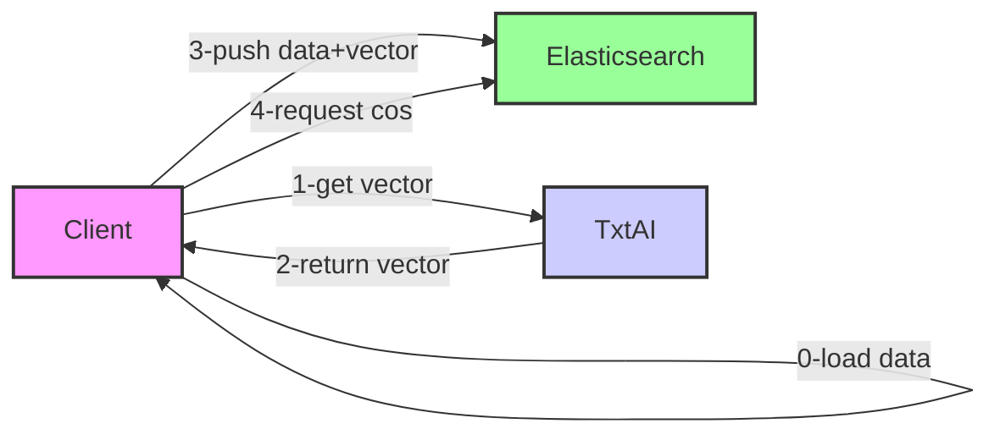

# txtai-elasticsearch

## Schema



## Accès
http://loacalhost:5601


## Create Elasticsearch Index

With kibana, 
```
PUT /movies
{
  "mappings": {
    "properties": {
      "title": {
        "type": "text"
      },
      "genre": {
        "type": "keyword"
      },
      "release_year": {
        "type": "integer"
      },
      "title_embedding": {
        "type": "dense_vector",
        "dims": 1536
      }
    }
  }
}
```

## Load data

in loadData, start : 
```
node load.js
```


## Issue
if elasticsearch has error : 
  ```
    Elasticsearch exited unexpectedly, with exit code 78
  ```
then execute the following command
  ```
    sudo sysctl -w vm.max_map_count=262144
  ```

## Liens
https://medium.com/bigdata-blog/how-to-use-elasticsearch-as-vector-database-5f1768f7d46a


## Vrac
curl -X POST "http://localhost:8000/add" -H "Content-Type: application/json" -d '[{"text": "text"}]'


curl -X POST "http://localhost:8000/add" \
  -H "Content-Type: application/json" \
  -d '[{"text": "Wears a red suit and says ho ho"}]'


curl -X POST "http://localhost:8000/add" \
  -H "Content-Type: application/json" \
  -d '[{"text": "Pulls a flying sleigh"}]'

curl -X POST "http://localhost:8000/add" \
  -H "Content-Type: application/json" \
  -d '[{"text": "This is cut down and decorated"}]'

curl -X POST "http://localhost:8000/add" \
  -H "Content-Type: application/json" \
  -d '[{"text": "Santa puts these under the tree"}]'      

curl -X POST "http://localhost:8000/add" \
  -H "Content-Type: application/json" \
  -d '[{"text": "Best way to spend the holidays"}]'  


